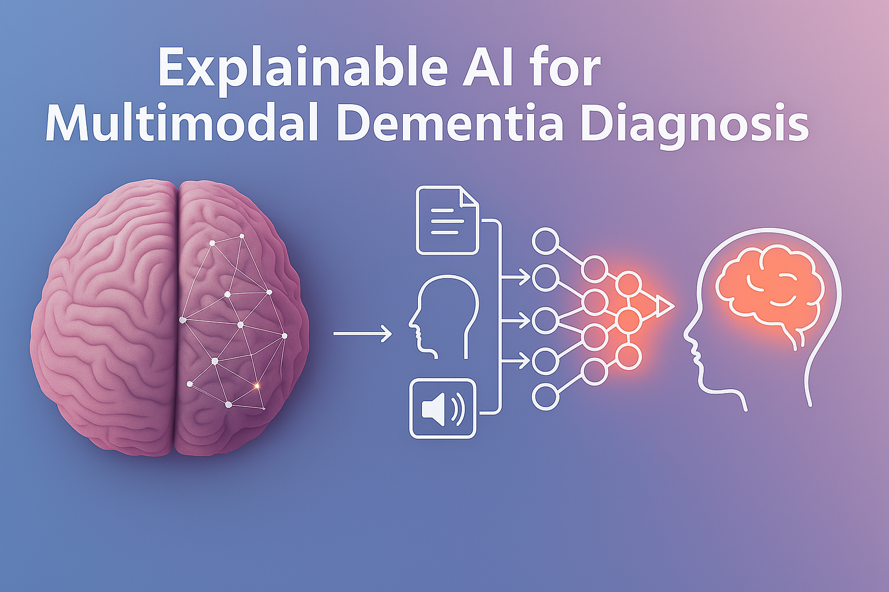

# Minds Unveiled: Explainable Multi-modal AI in Dementia Research



## Table of Contents

- [🔍 Overview](#-overview)
- [📚 Background](#-background)
- [🏗️ Project Structure](#️-project-structure)
- [🧠 Model Architectures](#-model-architectures)
  - [AD-Transformer](#ad-transformer)
  - [MMDF (Multimodal Medical Data Fusion)](#mmdf-multimodal-medical-data-fusion)
- [🔬 Explainable AI Techniques](#-explainable-ai-techniques)
- [📊 Data Processing Pipeline](#-data-processing-pipeline)
- [🚀 Installation & Setup](#-installation--setup)
- [🎯 Usage](#-usage)
- [📈 Results](#-results)
- [🔬 Research Findings](#-research-findings)
- [📝 Citation](#-citation)

## 🔍 Overview

This repository contains the complete implementation of **"Minds Unveiled: Explainable Multi-modal AI In Dementia Research"**, a comprehensive study applying state-of-the-art Explainable AI (XAI) techniques to multimodal dementia diagnosis models. The project implements two cutting-edge neural architectures that combine MRI imaging data with clinical features to diagnose Alzheimer's Disease and other forms of dementia.

### 🎯 Key Features

- **Two SOTA Models**: AD-Transformer and MMDF (Multimodal Medical Data Fusion)
- **Comprehensive XAI Suite**: Saliency Maps, Grad-CAM, Grad-CAM++, and GMAR
- **Multimodal Data Fusion**: MRI scans + clinical/demographic features
- **ADNI Dataset Integration**: Full preprocessing pipeline for neuroimaging data
- **Clinical Interpretability**: Tools designed for real-world medical applications

## 📚 Background

Early diagnosis of dementia is crucial for effective management and treatment planning. While AI models show promise for early detection, their "black-box" nature hinders clinical adoption. This project addresses this challenge by implementing and evaluating XAI techniques that make model decisions transparent and interpretable for clinicians.

### 🔬 Research Questions

1. Can existing multimodal AI architectures be adapted to incorporate explainable AI techniques without compromising accuracy?
2. Which XAI methods are most effective in elucidating decision-making processes?
3. What criteria should be considered when evaluating XAI-enhanced models for real-world dementia diagnosis?

## 🏗️ Project Structure

```
Thesis-main/
├── ADtransformer_pytorch/           # AD-Transformer implementation
│   ├── model_components/           # Core model architecture
│   │   ├── build_model.py         # Model factory and main architecture
│   │   ├── transformer_encoder.py # Transformer layers
│   │   ├── patch_cnn.py          # CNN for patch extraction
│   │   ├── embeddings.py         # Embedding layers
│   │   └── classifier.py         # Classification head
│   ├── explainability/            # XAI techniques for AD-Transformer
│   │   ├── saliency_maps.py      # Gradient-based saliency
│   │   ├── grad_cam.py           # Grad-CAM implementation
│   │   ├── grad_cam_plus_plus.py # Enhanced Grad-CAM
│   │   ├── gmar.py               # Gradient-Driven Multi-Head Attention Rollout
│   │   ├── run_explainability.py # XAI execution pipeline
│   │   └── confidence_diagram.py # Model confidence analysis
│   ├── data/                     # Data processing utilities
│   ├── config.yaml              # Model configuration
│   ├── train.py                 # Training pipeline
│   ├── main.py                  # Entry point
│   └── prepare_adni_dataset.py  # Data preprocessing
│
├── MMDF/                        # MMDF model implementation
│   ├── components/              # MMDF architecture components
│   │   ├── mri_vit.py          # Vision Transformer for MRI
│   │   ├── ma_cnn.py           # Multi-scale Attention CNN
│   │   ├── vit_patch_embedding.py # ViT patch processing
│   │   ├── transformer_encoder.py # Transformer layers
│   │   ├── self_adaptive_loss.py  # Advanced loss functions
│   │   └── ese_block.py        # Enhanced Squeeze-and-Excitation
│   ├── explainability/         # XAI techniques for MMDF
│   │   ├── saliency_maps.py    # Gradient-based explanations
│   │   ├── grad_cam.py         # Grad-CAM for CNNs
│   │   ├── grad_cam_plus_plus.py # Advanced localization
│   │   ├── gmar.py             # Attention rollout
│   │   ├── run_explainability.py # XAI pipeline
│   │   └── confidence_diagram.py # Confidence analysis
│   ├── data/                   # Data management
│   │   ├── image/              # MRI scan storage
│   │   └── non_image/          # Clinical data
│   ├── mmdf_model.py          # Main MMDF architecture
│   ├── train.py               # Training implementation
│   ├── data_loader.py         # Data loading utilities
│   └── config.py              # Model configuration
│
├── scripts/                   # Utility scripts
├── requirements.txt          # Dependencies
└── README.md                # This file
```

## 🧠 Model Architectures

### AD-Transformer

The **AD-Transformer** is a unified multimodal framework that processes both structural MRI and clinical data through a shared transformer architecture.

#### 🏗️ Architecture Components

- **[Patch CNN](ADtransformer_pytorch/model_components/patch_cnn.py)**: Converts 3D MRI scans into patch tokens
- **[Non-Image Embeddings](ADtransformer_pytorch/model_components/embeddings.py)**: Linear projection of clinical features
- **[Transformer Encoder](ADtransformer_pytorch/model_components/transformer_encoder.py)**: Multi-head attention for cross-modal fusion
- **[Classification Head](ADtransformer_pytorch/model_components/classifier.py)**: Final diagnosis prediction

#### ⚙️ Configuration

The model is configured via [`config.yaml`](ADtransformer_pytorch/config.yaml):

```yaml
# Key parameters
image:
  shape: [144, 144, 144]      # 3D MRI dimensions
  patch_size: 36              # Patch extraction size
  num_patches: 64             # Number of patches per image

transformer:
  num_heads: 8                # Multi-head attention
  num_layers: 1               # Transformer depth
  ffn_dim: 256               # Feed-forward dimension

training:
  batch_size: 32
  epochs: 5
  learning_rate: 0.001
```

### MMDF (Multimodal Medical Data Fusion)

The **MMDF** model combines a Vision Transformer (ViT) for MRI processing with a Multi-scale Attention CNN for clinical data, featuring sophisticated fusion mechanisms.

#### 🏗️ Architecture Components

- **[MRI-ViT](MMDF/components/mri_vit.py)**: Vision Transformer specialized for medical imaging
- **[MA-1DCNN](MMDF/components/ma_cnn.py)**: Multi-scale Attention 1D CNN for clinical features
- **[ESE Block](MMDF/components/ese_block.py)**: Enhanced Squeeze-and-Excitation for feature refinement
- **[Self-Adaptive Loss](MMDF/components/self_adaptive_loss.py)**: Advanced loss functions for robust training

#### 🔄 Fusion Strategy

The MMDF model employs a three-stage fusion approach:

1. **Feature Extraction**: Separate processing of each modality
2. **Feature Fusion**: Concatenation of learned representations
3. **Joint Classification**: Unified prediction with auxiliary heads

#### ⚙️ Configuration

Model parameters are defined in [`config.py`](MMDF/config.py):

```python
# Vision Transformer settings
vit_patch_size: int = 6
vit_embed_dim: int = 64
vit_depth: int = 8
vit_num_heads: int = 8

# CNN settings
ma_conv_kernels: List[int] = [32, 64, 128, 64]
ma_kernel_sizes: List[int] = [3, 5, 1, 5, 3, 5, 1, 5]

# Fusion settings
fusion_hidden_dims: List[int] = [64, 32]
fusion_dropout: float = 0.1
```

## 🔬 Explainable AI Techniques

Both models implement a comprehensive suite of XAI techniques to provide clinical interpretability:

### 📊 Feature Importance Analysis

#### [Gradient-based Saliency Maps](ADtransformer_pytorch/explainability/saliency_maps.py)
- **Purpose**: Pixel-level importance analysis
- **Method**: First-order Taylor expansion of model outputs
- **Output**: Pixel-wise importance heatmaps + feature importance rankings

### 🎯 Region-based Explanations

#### [Grad-CAM](ADtransformer_pytorch/explainability/grad_cam.py)
- **Purpose**: Class-specific region highlighting
- **Method**: Gradient-weighted activation maps from convolutional layers
- **Output**: Coarse-grained attention heatmaps

#### [Grad-CAM++](ADtransformer_pytorch/explainability/grad_cam_plus_plus.py)
- **Purpose**: Enhanced localization for multiple regions
- **Method**: Higher-order gradients with pixel-wise weighting
- **Output**: More precise attention maps for complex cases

### 🔍 Attention Analysis

#### [GMAR (Gradient-Driven Multi-Head Attention Rollout)](ADtransformer_pytorch/explainability/gmar.py)
- **Purpose**: Transformer attention pattern analysis
- **Method**: Gradient-weighted attention head importance
- **Output**: Token-level attention visualizations

### 📈 Confidence Assessment

#### [Confidence Diagrams](ADtransformer_pytorch/explainability/confidence_diagram.py)
- **Purpose**: Model uncertainty quantification
- **Method**: Prediction confidence distribution analysis
- **Output**: Reliability calibration plots

### 🚀 Running Explainability Analysis

Execute comprehensive XAI analysis using:

```bash
# AD-Transformer explainability
python ADtransformer_pytorch/explainability/run_explainability.py

# MMDF explainability
python MMDF/explainability/run_explainability.py
```

## 📊 Data Processing Pipeline

### 🧬 ADNI Dataset Integration

The project uses the **Alzheimer's Disease Neuroimaging Initiative (ADNI)** database, specifically the ADNIMERGE dataset combining multiple ADNI cohorts.

#### 📋 Data Components

**Clinical Features** (15 selected features):
- Demographics: Age, Gender, Education, Race, Ethnicity, Marital Status
- Genetic: APOE genotype
- Biomarkers: FDG-PET, PIB-PET, AV45-PET, CSF Aβ, CSF Tau, CSF p-Tau

**Imaging Data**:
- **MRI Types**: MPRAGE, FLAIR, MT1
- **Preprocessing**: Skull stripping, bias correction, standardization
- **Format**: 3D volumes (144×144×144) or 2D slices

#### 🔄 Preprocessing Pipeline

1. **[Data Cleaning](ADtransformer_pytorch/prepare_adni_dataset.py)**:
   - Remove features causing data leakage (cognitive assessments)
   - Handle missing values with K-NN imputation
   - One-hot encode categorical variables

2. **Image Preprocessing**:
   - Skull stripping using FSL
   - N4 bias field correction
   - Intensity normalization
   - Spatial standardization

3. **Feature Engineering**:
   - APOE genotype conversion to allele counts
   - Biomarker log-transformation
   - Standard scaling with training set statistics

## 🚀 Installation & Setup

### 📋 Prerequisites

- Python 3.11+
- 16GB+ RAM
- 50GB+ storage for ADNI data

### 🔧 Environment Setup

1. **Clone the repository**:
```bash
git clone <repository-url>
cd Thesis-main
```

2. **Install dependencies**:
```bash
pip install -r requirements.txt
```

3. **Install additional neuroimaging tools**:
```bash
# FSL (for image preprocessing)
# Follow FSL installation guide: https://fsl.fmrib.ox.ac.uk/fsl/fslwiki/FslInstallation

# Alternatively, install neuroimaging Python packages
pip install nibabel nilearn
```

### 📁 Data Setup

1. **Download ADNI data** (requires registration at adni.loni.usc.edu)
2. **Organize data structure**:
```
data/
├── ADNI/
│   └── ADNIMERGE/
│       ├── processed_images/
│       │   ├── MPRAGE_resized/
│       │   ├── FLAIR_resized/
│       │   └── T1_resized/
│       └── processing/
├── non_image/
│   ├── ADNIMERGE_fully_processed_train.csv
│   └── ADNIMERGE_fully_processed_test.csv
```

## 🎯 Usage

### 🚀 Training Models

#### AD-Transformer Training

```bash
cd ADtransformer_pytorch
python main.py \
    --train_csv /path/to/train.csv \
    --test_csv /path/to/test.csv \
    --config config.yaml \
    --output_dir ./output/
```

#### MMDF Training

```bash
cd MMDF
python train.py
```

### 🔍 Explainability Analysis

```bash
# Generate comprehensive explanations
cd ADtransformer_pytorch/explainability
python run_explainability.py --model_path ../output/best_model.pth

cd MMDF/explainability  
python run_explainability.py --model_path ../trained_models/best_model.pth
```

### ⚙️ Configuration

#### AD-Transformer Configuration

Edit [`ADtransformer_pytorch/config.yaml`](ADtransformer_pytorch/config.yaml):

```yaml
# Enable/disable components
image:
  use_images: true
  use_slice_selection: true

# Training settings
training:
  batch_size: 32
  epochs: 5
  learning_rate: 0.001
  use_class_weights: true

# Model architecture
transformer:
  num_heads: 8
  num_layers: 1
  dropout: 0.3
```

#### MMDF Configuration

Modify [`MMDF/config.py`](MMDF/config.py):

```python
# Classification task
perform_binary_classification_cn_ad: bool = True  # CN vs AD
# Set to False for 3-class (CN vs MCI vs AD)

# Training mode
training_mode: str = "full"  # Options: "full", "image_only", "clinical_only"

# Model parameters
vit_depth: int = 8
ma_conv_kernels: List[int] = [32, 64, 128, 64]
```

## 📈 Results

### 🎯 Model Performance

| Model | Task | Accuracy (This Study) | Reported SOTA |
|-------|------|----------------------|---------------|
| AD-Transformer | CN vs AD | 48% | 95.9% |
| MMDF | CN vs AD | 76% | - |
| MMDF | CN vs MCI vs AD | 42% | 97.35% |

### 🔍 Key Findings

1. **Reproducibility Challenges**: Significant performance gaps from reported results
2. **Data Leakage Issues**: Many SOTA claims likely compromised by including cognitive assessments
3. **Modality Reliance**: Models predominantly rely on clinical features over imaging
4. **XAI Effectiveness**: Successfully implemented interpretable explanations

### 🧠 XAI Insights

- **Saliency Maps**: Provide pixel-level importance but can be noisy
- **Grad-CAM/Grad-CAM++**: Better for clinical interpretation with region-level focus
- **GMAR**: Excellent for understanding transformer attention patterns
- **Model-Specific vs Agnostic**: Model-specific approaches provide more detailed insights

## 🔬 Research Findings

### 🚨 Critical Discovery: Data Leakage in SOTA Claims

This study uncovered a critical issue in dementia AI research: many state-of-the-art performance claims may be compromised by **indirect data leakage** through the inclusion of cognitive assessment scores (MMSE, ADAS) in training data.

### 📊 Impact on Reproducibility

- **Transparency Issues**: Reluctance of researchers to clarify non-image features
- **Performance Inflation**: Cognitive assessments already used for clinical diagnosis
- **Generalization Problems**: Models converge on diagnostic shortcuts rather than learning from imaging

### 🎯 XAI Contributions

1. **Enhanced Trust**: Clinicians can understand model reasoning
2. **Bias Detection**: XAI reveals over-reliance on specific features
3. **Clinical Adoption**: Interpretable AI more suitable for medical practice

### 🔮 Future Directions

1. **Standardized Reporting**: Need for transparent methodology descriptions
2. **Robust Validation**: Clinical validation of XAI explanations
3. **Improved Models**: Focus on genuine multimodal learning without data leakage

## 📝 Citation

If you use this code or findings in your research, please cite:

```bibtex
@article{schmeitz2025minds,
  title={Minds Unveiled: Explainable Multi-modal AI In Dementia Research},
  author={Schmeitz, Camiel},
  journal={Bachelor Thesis, Maastricht University},
  year={2025},
  note={Data used in preparation of this article were obtained from the Alzheimer's Disease Neuroimaging Initiative (ADNI) database}
}
```

### 🏥 ADNI Acknowledgment

Data collection and sharing for this project were funded by the Alzheimer's Disease Neuroimaging Initiative (ADNI). For complete ADNI acknowledgments and investigator listings, see the full thesis document.

---

**Contact**: For questions about implementation or research collaboration, please open an issue in this repository.
